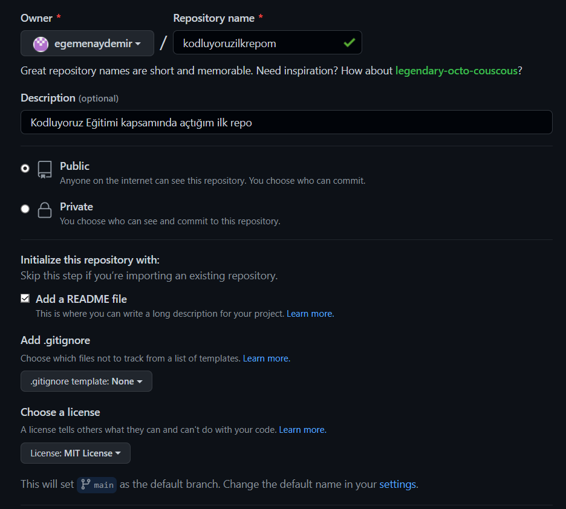

# Kodluyoruz Ilk Repo
---
Bu repo [Kodluyoruz](https://kodluyoruz.org/tr/kodluyoruz/) Front-End Eğitiminde oluşturduğumuz ilk repo. İçerisinde bir adet README dosyası, bir adet de index.html barındırıyor

##Installation
---
Öncelikle projeyi clonelayın.
> blockquote git clone https://github.com/egemenaydemir/kodluyoruzilkrepo

##Usage
---
Projeyi cloneladıktan sonra Visual Studio Code programında açınız.

Linux için:
> blockquote cd kodluyoruzilkrepo
code .

##Contributing
---
Pull requestler kabul edilir. Büyük değişiklikler için, lütfen önce neyi değiştirmek istediğinizi tartışmak için bir konu açınız.

##License
[MIT](https://choosealicense.com/licenses/mit/)